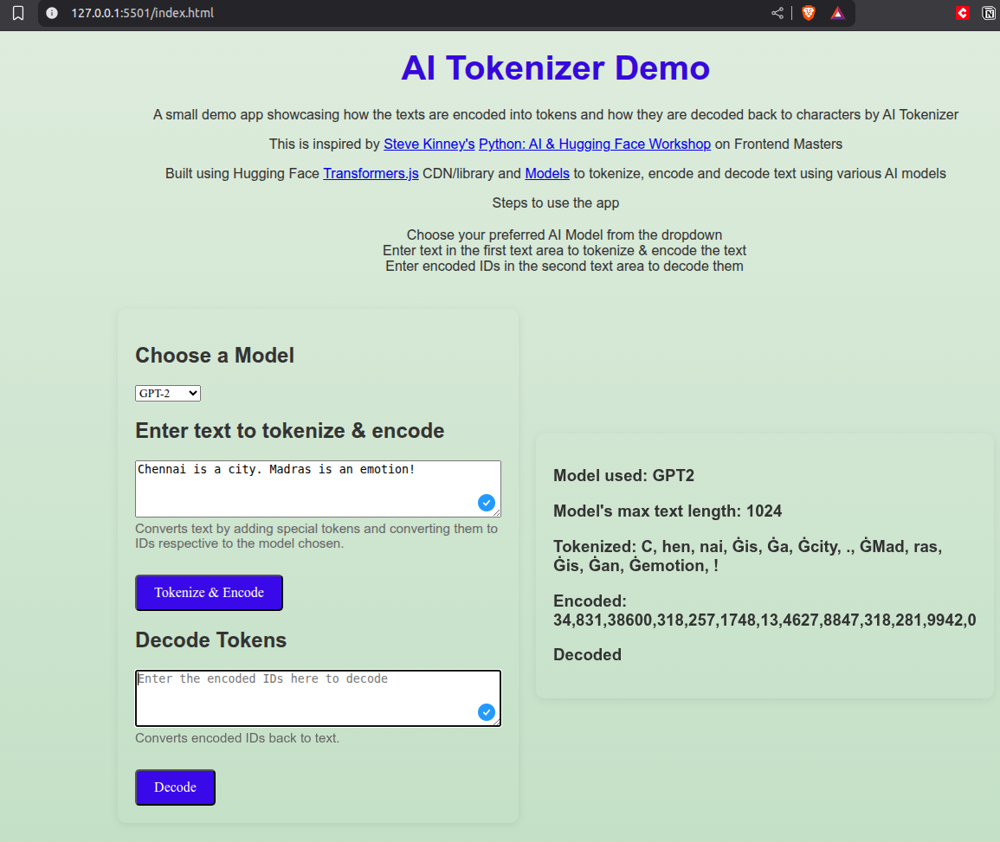
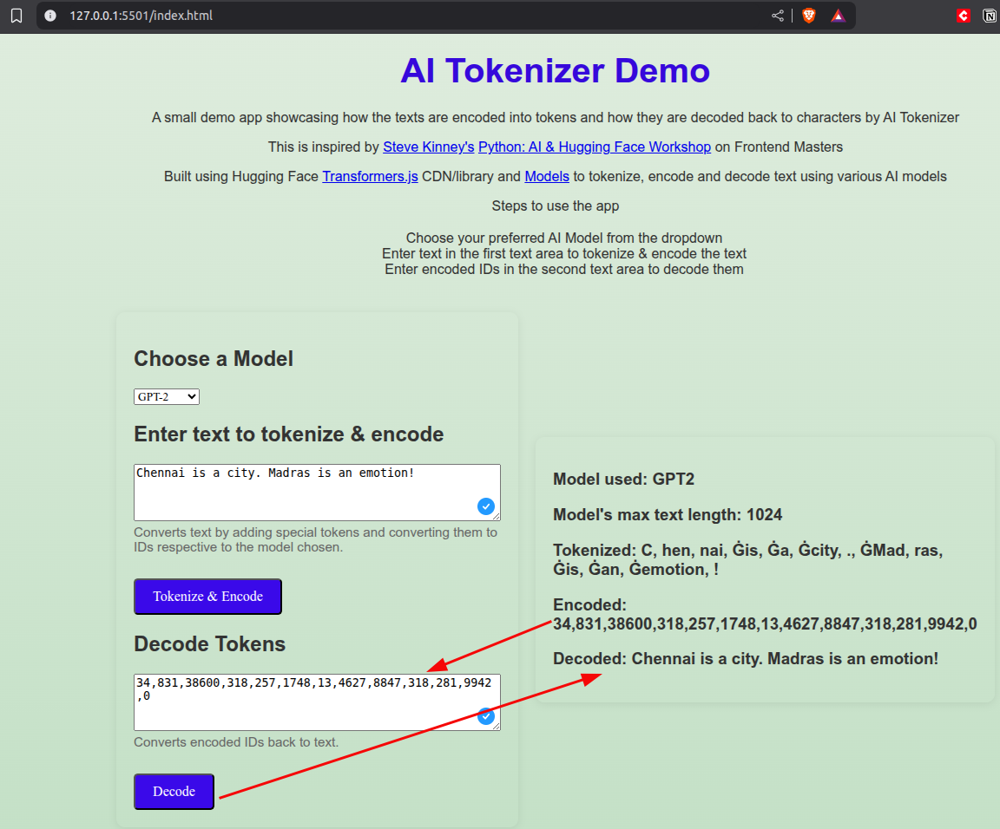

# AI Tokenizer - Demo

A simple demo app showcasing how texts are encoded into tokens and decoded back to characters using AI Tokenizer models.

This project is inspired by [Steve Kinney's](https://linkedin.com/in/stevekinney) [Python: AI & Hugging Face Workshop](https://frontendmasters.com/workshops/python-ai/) on Frontend Masters.

Built using Hugging Face [Transformers.js](https://huggingface.co/models?library=transformers.js) CDN/library and [Models](https://huggingface.co/models) to tokenize, encode, and decode text using various AI models.

---

## How to Use

### 1. Clone or Download the Repository

```sh
git clone https://github.com/devendran-m/ai-tokenizer.git
cd ai-tokenizer
```

### 2. Install Dependencies (Optional)

If you want to use the npm package (not required for browser usage):

```sh
npm install
```

### 3. Start a Local Server

You need to serve the files over HTTP. You can use [Live Server](https://marketplace.visualstudio.com/items?itemName=ritwickdey.LiveServer) in VS Code, or run:

```sh
npx serve .
```
or
```sh
python3 -m http.server
```

### 4. Open the App in Your Browser

Navigate to `http://localhost:5501` (or the port your server uses) and open `index.html`.

---

## Features

- **Choose Model:** Select from GPT-2, BERT, RoBERTa, or T5.
- **Tokenize & Encode:** Enter text to see how it is tokenized and encoded into IDs.
- **Decode:** Enter encoded IDs to decode them back to text.
- **Model Info:** View the selected model and its maximum text length.

---

## Step-by-Step Usage

1. **Select a Model:**  
   Use the dropdown to choose your preferred AI model.

2. **Tokenize & Encode Text:**  
   - Enter your text in the "Enter text to tokenize & encode" textarea.
   - Click the "Tokenize & Encode" button.
   - The app will display the tokenized text and the encoded IDs.



3. **Decode Tokens:**  
   - Enter a comma-separated list of token IDs in the "Decode Tokens" textarea.
   - Click the "Decode" button.
   - The app will display the decoded text.



---

## Notes

- The app uses the Hugging Face Transformers.js library via CDN.
- Text input is limited to 100 characters for demonstration.
- No API keys or backend required.

---

## To Dos / Next Steps

1. **Tests:**  
   Add automated tests for encoding, decoding, and UI interactions.

2. **Rate Limits:**  
   Implement rate limiting to prevent abuse and ensure fair usage.

3. **Visitor Counts:**  
   Add a reliable visitor counter to track usage statistics.

4. **Improve UI:**  
   Enhance the user interface for better usability and accessibility.

5. **Expand to Other Concepts:**  
   Extend the app to cover advanced topics such as fine-tuning models and image generation.

---

## License

MIT